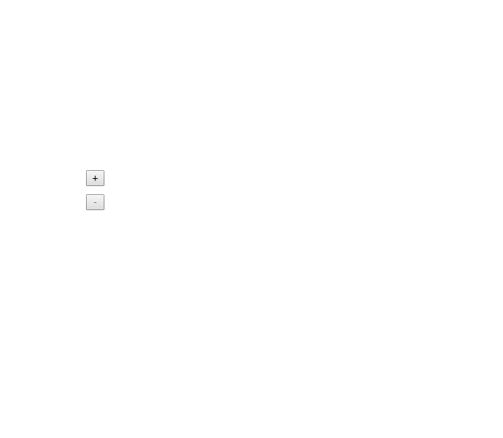

# react-steack

Animate stacks with great performances



[DEMO](https://meriadec.github.io/react-steack/)

## Install

```
npm i -S react-steack
```

or

```
yarn add react-steack
```

## Usage

```javascript
import Steack from 'react-steack'

// ...

<Steack
  reverse={true}
  align='right'
  springConfig={{
    stiffness: 250,
    damping: 20,
  }}
>
  {items.map(item => (
    <div key={item.id}>
      {'item content'}
    </div>
  ))}
</Steack>
```
